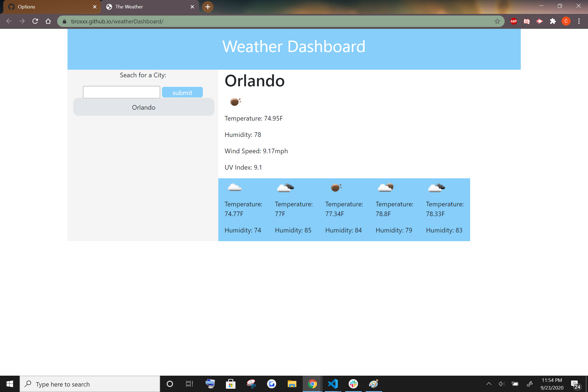

# weatherDashboard
https://tiroxxx.github.io/weatherDashboard/

## Technologies
Built with bootstrap, jQuery, and openweather API

## Summary
This application will let you search for a city and give you the current weather and a five day forecast of this city. It will also keep your latest search. As of now, when the page is refreshed, only 8 of the previous searches will be added to the page, but without refreshing there is no limit.

## License

Licensed under the [MIT License](LICENSE)

## Contact

email: christianmarquez41@gmail.com
